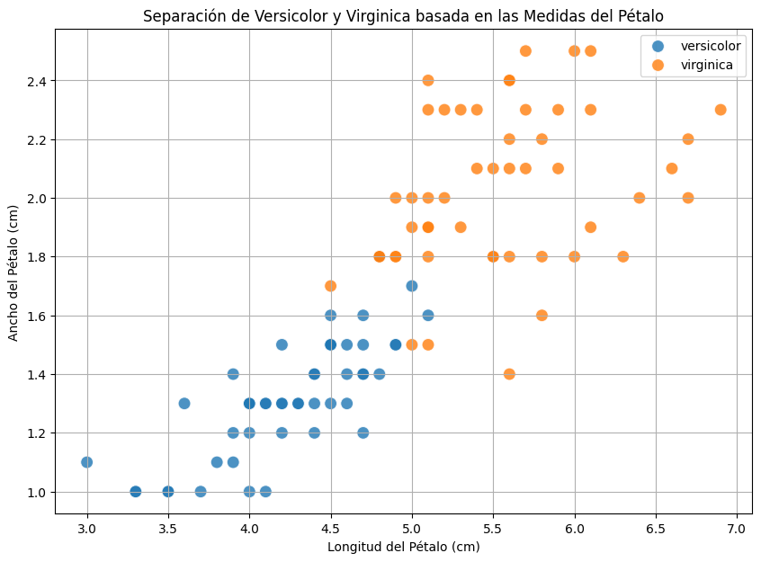

# 🌸 Clasificación de Flores Iris: Pipeline Básico de ML

Este repositorio contiene una implementación práctica de un pipeline de Machine Learning "end-to-end" utilizando Scikit-Learn. El objetivo es resolver el clásico problema de clasificación del dataset Iris mediante un modelo de Regresión Logística (Baseline).

## 📋 Descripción del Proyecto

El proyecto sigue el flujo de trabajo estándar en Ciencia de Datos, abarcando desde la carga de datos hasta la interpretación del modelo. Se ha implementado bajo la filosofía de "IA en 10 líneas" (código conciso y efectivo).

### Flujo de trabajo:
1.  **Carga de datos:** Uso del dataset Iris de Scikit-Learn.
2.  **Preprocesamiento:** División estratificada de datos (80% train, 20% test).
3.  **Modelado:** Entrenamiento de un modelo de `LogisticRegression`.
4.  **Evaluación:** Cálculo de *accuracy* y reporte de clasificación (Precision, Recall, F1-Score).
5.  **Interpretación:** Análisis visual de los errores entre las clases *Versicolor* y *Virginica*.

## 🛠️ Tecnologías utilizadas

* **Python 3**
* **Scikit-Learn:** Para el modelo y métricas.
* **Pandas & NumPy:** Manipulación de datos.
* **Matplotlib & Seaborn:** Visualización e interpretación de resultados.

## 📊 Resultados

El modelo base alcanzó un rendimiento excelente:

| Métrica | Valor |
|---------|-------|
| **Accuracy Global** | **97%** |

**Interpretación del modelo:**
* **Setosa:** Clasificación perfecta (100% precision/recall). Es linealmente separable de las otras dos.
* **Versicolor y Virginica:** El modelo presenta una ligera confusión entre estas dos especies debido a la similitud en las dimensiones de sus pétalos, como se observa en el análisis gráfico del notebook.

## 🚀 Cómo ejecutar este proyecto

1.  Clona el repositorio:
    ```bash
    git clone [https://github.com/Leofu2005/ia-curso-colab.git](https://github.com/Leofu2005/ia-curso-colab.git)
    ```
2.  Instala las dependencias:
    ```bash
    pip install -r requirements.txt
    ```
3.  Abre el notebook:
    ```bash
    jupyter notebook S1_PRÁCTICA_IA_en_10_líneas_LFU.ipynb
    ```

## 📈 Visualización

El análisis gráfico demuestra que la longitud y el ancho del pétalo son variables discriminantes clave. Se observa claramente que la clase *Setosa* está bien separada, mientras que existe una pequeña "zona gris" o superposición entre las clases *Versicolor* y *Virginica*, lo que explica los ligeros errores del modelo.



---
*Práctica realizada como parte del estudio de fundamentos de Inteligencia Artificial.*
